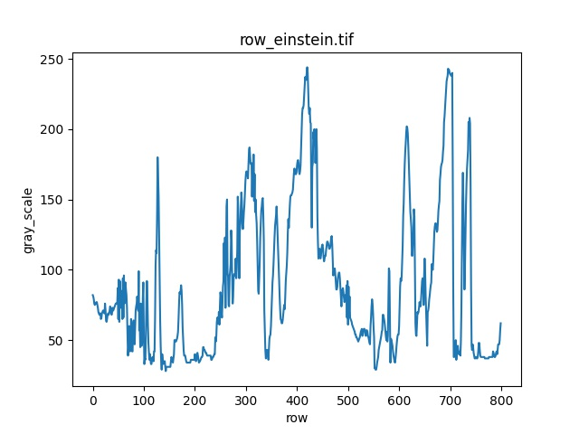
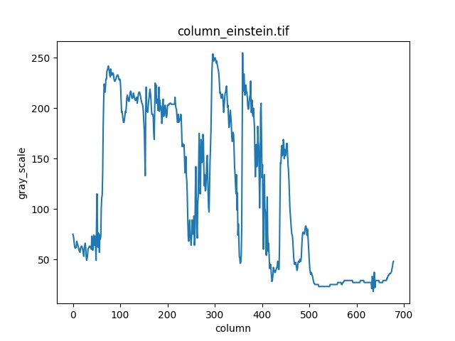
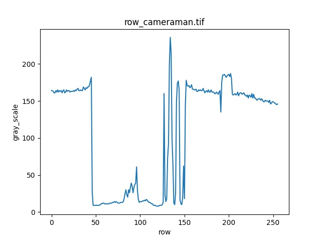
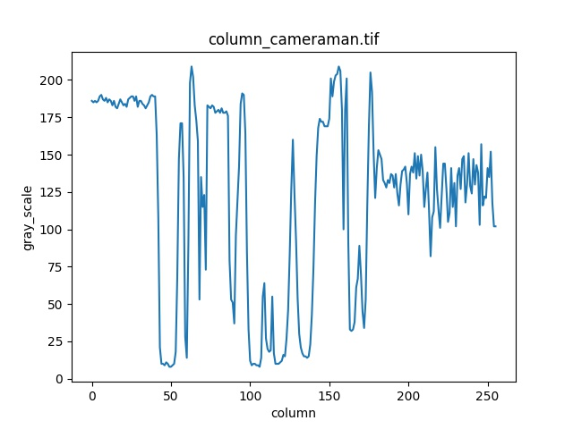
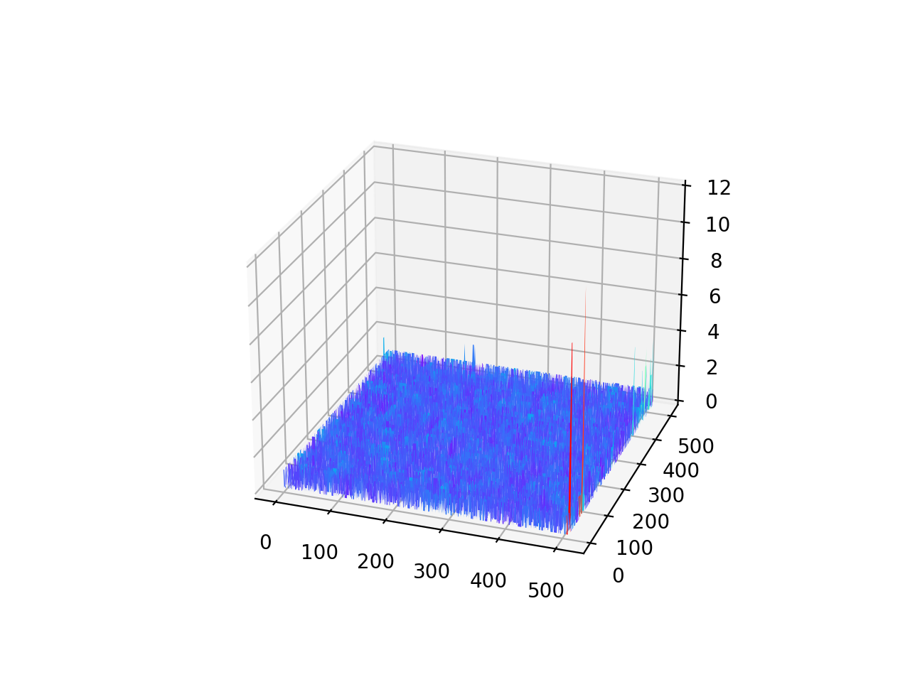
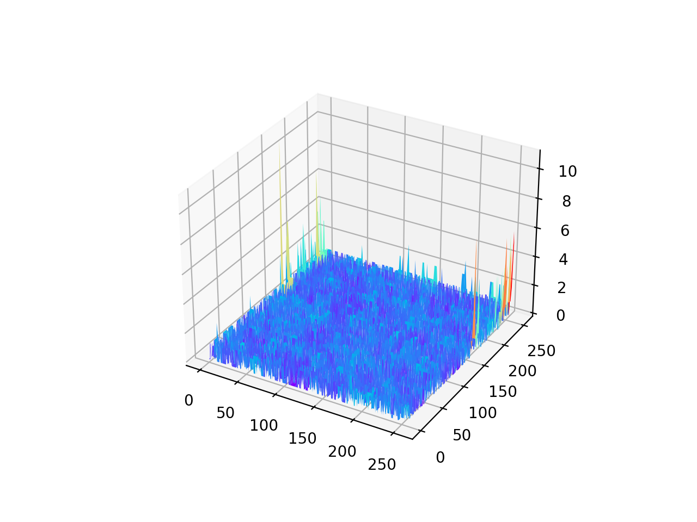
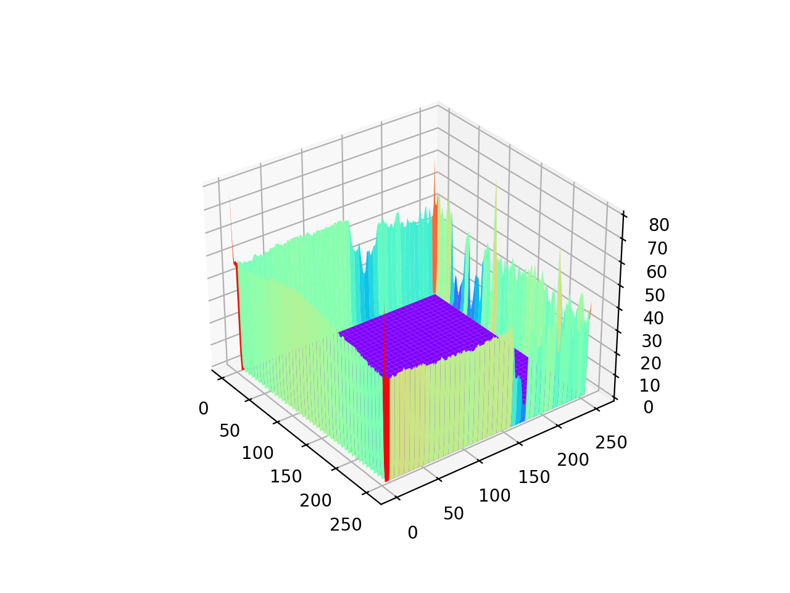
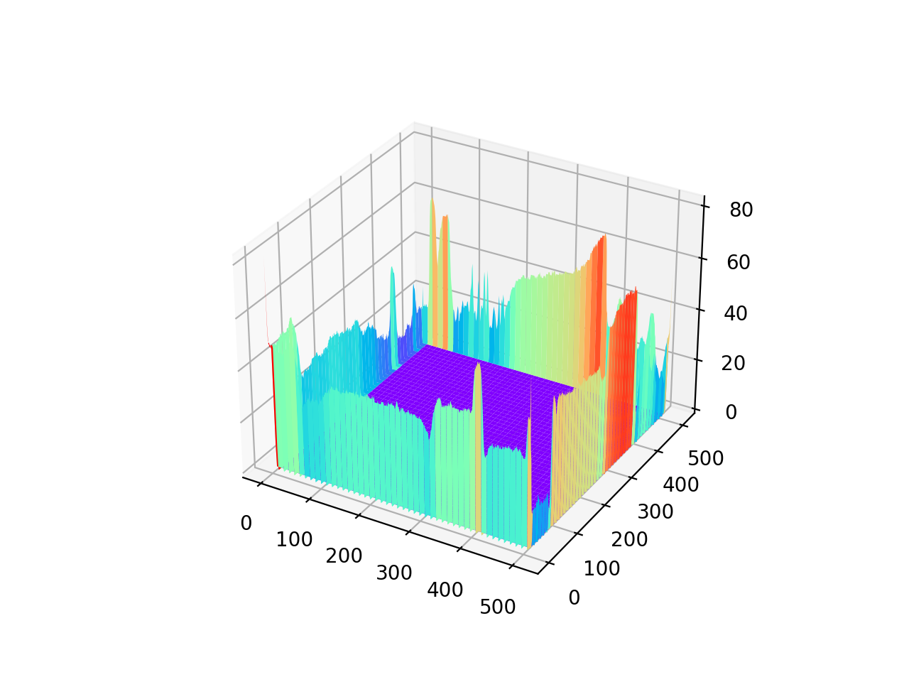

# 第一次作业说明

## 概述

所用语言为`python3.x`,IDE为`pycharm2020`,使用到系统自带库`time`,`sys`,`math`，所调用的外部库包括`numpy` ,`opencv-python`，画图时使用`matplotlib`，为加速计算使用`numba.jit`的`@jit`修饰器，如不用加速计算可以取消，每道题的函数入口均为对应题号文件夹下的`main.py`函数

## 题解

1. 将灰度图读入数组，使用`shape`函数读取数组行列数，对行列数进行舍断取整得到中间行列数。利用数组切片，将中间行或列分别以行向量或列向量的形式读入新数组，行数列数为偶数时，中间行中间列默认为中间偏右偏下的一行一列。生成灰度序列折线图。折线图命名为'row_'+原名+'.jpg'或'column\_'+原名+'.jpg'放在根目录中。

   |     name      |                中间行                 |                   中间列                    |
   | :-----------: | :-----------------------------------: | :-----------------------------------------: |
   | einstein.tif  |    |    |
   | cameraman.tif |  |  |

     

   

2. 先将图像以灰度图的格式读取显示为'raw'窗口，作为自带函数的处理结果用以对比。实际操作时，将3通道RGB原图读入数组。初始化一个全0二维数组'out'用来存放结果。对于原图数组的第一维3通道，分别以'average'或'NTSC'的计算公式对3通道数据进行处理再存入到'out'数组中去，再显示为图像。图像以'处理方式_'+原名的命名方式保存在根目录中。

   结果如下：

   |                    raw                    |                          average                          |                        NTSC                         |
   | :---------------------------------------: | :-------------------------------------------------------: | :-------------------------------------------------: |
   |  |  |  |
   |       |       |       |

   

3. 首先读取卷积核数组的行列数，将卷积核翻转180度。读取原灰度图存入数组'arr_img'中，并得到其行列数。初始化数组'out_arr'作为存放最终卷积结果的二维数组，初始化数组'padding_img'作为扩展边界后的数组，扩展的行列数分别为2倍卷积核向下取整行列数的一半。将填补边界数组分为四个角，四条边，中间几个部分分别处理。中间部分直接用原图数组覆盖，其他八个部分，通过运算，将原数组中对应位置的数据填入，用0填补则全部放入0。卷积时，将卷积核按顺序与填补后的数组进行卷积计算，将得到的结果放入'ouy_arr'中，并进行输出。用一个5*5的均值卷积核进行测试，得到结果图像以'处理方法_'+原名的命名保存在根目录中。

   结果如下：

   | raw                               | zero                                        | replicate                                             |
   | --------------------------------- | ------------------------------------------- | ----------------------------------------------------- |
   |  |  |  |
   |    |    |    |

4. 高斯滤波核w的最小大小用公式$min_m = math.ceil(3*sig)\times2+1$进行计算，其中`math.ceil`为向上取整，以保证卷积核足够大。缺省m为-1，此时没有给出m，将m自动选为最小值。对于w的各个具体取值，则将二维高斯函数分布离散化填入，同时用sum记录各个值的累加合。最后将w的各个项均除以sum得到归一化的高斯滤波核。

5. 将所要读取的图像名以字符串传给f，将f用第2问的函数转为灰度图，返回处理后得到灰度图的名称给f，选定高斯滤波卷积核参数，传入`gaussKernel`函数，返回卷积核矩阵w，传入`twodConv`进行卷积处理。

   |                            原图                            |                          $\sigma=1$                          |                          $\sigma=2$                          |                          $\sigma=3$                          |                          $\sigma=5$                          |
   | :--------------------------------------------------------: | :----------------------------------------------------------: | :----------------------------------------------------------: | :----------------------------------------------------------: | :----------------------------------------------------------: |
   |  |  |  |  |  |
   |         |  |  |  |  |
   |                   |  |  |  |  |
   |                 |  |  |  |  |

   

## $\sigma = 1$下函数处理结果与直接调用cv函数结果比较

对比函数的处理结果与直接调用库函数结果，得到的差值非常小，灰度值差距基本在5以下，在边界处可能由于填补方式不同，有少数点差距较大。

|                         代码计算结果                         |                直接调用opencv函数结果                |                差值图像                 |             差值三维分布图              |
| :----------------------------------------------------------: | :--------------------------------------------------: | :-------------------------------------: | :-------------------------------------: |
|  |  |  |  |
|  |     |  |  |

## 比较补零和复制下滤波结果在边界上的差异

在$\sigma=1$情况下对如下两图不同边界补值的结果进行比较，可以看出在边界上，复制补值的结果比补零的结果得到的图像灰度高出许多

|                             原图                             |            两种结果差值图像             |             差值三维分布图              |
| :----------------------------------------------------------: | :-------------------------------------: | :-------------------------------------: |
|                             |  |  |
|  |  |  |

